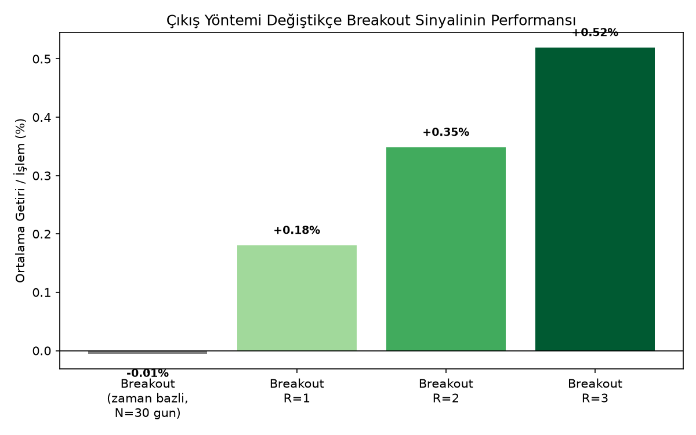
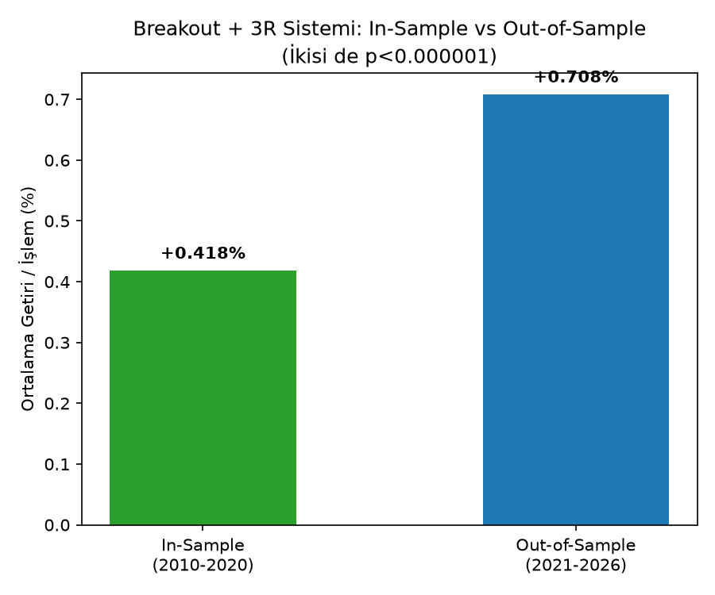

# Fiyat-Bazlı Çıkış Stratejileri: Çıkış Yöntemi, Sinyalden Daha mı Önemli?

## Amaç

Önceki araştırmalarımızda (Golden Cross, Breakout, Bollinger Bands) sinyal sonrası performansı hep **sabit bir gün sayısı (N) sonra fiyata bakarak** ölçtük. Bu proje şu soruyu soruyor: **Sinyallerin "zayıf" çıkmasının sebebi sinyalin kendisi mi, yoksa kullandığımız kaba ölçüm yöntemi mi?** Cevabı bulmak için, aynı sinyalleri **gerçekçi bir fiyat-bazlı çıkış** (stop-loss + kâr hedefi, hangisi önce tetiklenirse) ile yeniden test ettik.

## Yöntem: Olay-Tabanlı Simülasyon (Event-Driven Backtesting)

Her sinyal için:
- **Giriş:** Sinyal günü kapanışı
- **Stop-Loss:** Sinyal günü en düşük fiyatı (Low)
- **Kâr Hedefi:** Stratejiye göre değişir (aşağıda)
- Her sonraki gün için **High/Low** kontrol edilir — hangisi (stop mu hedef mi) **önce** tetiklenirse pozisyon o an, o fiyattan kapanır. 90 gün içinde hiçbiri tetiklenmezse, kapanış fiyatıyla kapatılır (zaman aşımı).

Bu, önceki projelerdeki "N gün sonra sabit bir noktaya bak" yönteminden temel bir farkla ayrılıyor: **zamana değil, fiyatın gerçekte nereye gittiğine** bakıyor.

## Bulgular

### 1. Bollinger Bands: Zaman-Bazlı Çıkışta Sınırda (`1_bollinger_zaman_bazli_cikis.py`)

Alt bandı fitille delip kapanışta üstüne dönen ("rejection") sinyali, 4 varlıkta N=30 gün sabit bekleme ile test edildi: `n=712`, `p=0.4081` — **anlamlı değil**, yön varlığa göre değişiyor (Nasdaq/S&P pozitif, Altın/BIST negatif).

Ancak tek varlıkta (Nasdaq) `p=0.0553` — sınıra çok yakın, bu bizi fiyat-bazlı çıkışı denemeye yöneltti.

### 2. Bollinger Bands: Fiyat-Bazlı Çıkış (`2_bollinger_fiyat_hedefli_cikis.py`)

Stop = sinyal günü Low, Hedef = Orta Bant ya da Üst Bant:

| Hedef | n (çakışmalı) | Ort. Getiri | p-değeri | n (bağımsız) | Ort. Getiri (bağımsız) | p-değeri (bağımsız) |
|---|---|---|---|---|---|---|
| Orta Bant | 705 | %0.204 | 0.0330 | ~470 | ~%0.20 | anlamlı |
| **Üst Bant** | **717** | **%0.538** | **0.0003** | **481** | **%0.671** | **0.0006** |

Hedefi genişletmek (Orta → Üst Bant), kazanma oranını düşürdü (%37.6 → %25.7) ama **beklentiyi 2.6 kat artırdı**. 4 varlığın 4'ünde de tutarlı pozitif yön, bağımsızlık düzeltmesinden geçti.

### 3. EMA Golden Cross ve Breakout'a Aynı Mantığı Uygulamak (`3_ema_ve_breakout_r_katli_tarama.py`)

Bu sinyallerde Bollinger'daki gibi doğal bir "bant" hedefi yok, bu yüzden hedefi **sabit R-katı** (risk mesafesinin katı) olarak tanımladık ve R=1,2,3 denedik:

**EMA Golden Cross:** `n=38` (çok küçük örneklem, EMA kesişimi nadir) — hiçbir R değerinde anlamlı değil.

**Breakout:**

| R | n | Ort. Getiri | Kazanma | p-değeri |
|---|---|---|---|---|
| 1 | 1444 | %0.180 | %54.8 | <0.0001 |
| 2 | 1444 | %0.348 | %41.5 | <0.0001 |
| **3** | **1444** | **%0.519** | **%35.2** | **<0.0001** |

**Bu, önceki Breakout araştırmamızdaki "edge yok" sonucunun tam tersi.** Zaman-bazlı çıkışla ölçtüğümüzde Breakout sinyalinin baseline'dan farksız göründüğünü bulmuştuk — ama bu, **yanlış ölçüm yöntemi kullandığımız için** yanıltıcıymış.

### 4. Kazanan Sistemin Doğrulanması: Breakout + 3R (`4_breakout_3R_dogrulama.py`)

En güçlü kombinasyon (Breakout, Hedef=3R) tüm sağlamlık testlerinden geçirildi:

**Bağımsızlık düzeltmesi:**

| Varlık | Çakışmalı | Bağımsız (%) |
|---|---|---|
| Nasdaq 100 | 393 | 245 (%62.3) |
| S&P 500 | 443 | 239 (%54.0) |
| Altın | 277 | 159 (%57.4) |
| BIST 100 | 331 | 175 (%52.9) |

Bağımsız örneklemde (`n=818`) sonuç **korunuyor, hatta iyileşiyor**: Ort. Getiri %0.519 → %0.600, `p<0.000001`.

**In-Sample / Out-of-Sample (2010-2020 vs 2021-2026):**

| Dönem | n | Ort. Getiri | Kazanma | p-değeri |
|---|---|---|---|---|
| In-Sample (2010-2020) | 942 | %0.418 | %34.4 | <0.000001 |
| **Out-of-Sample (2021-2026)** | **502** | **%0.708** | **%36.7** | **<0.000001** |

**Out-of-Sample sonucu, In-Sample'dan bile daha güçlü çıktı** — önceki projedeki (`X=92,Y=50`) in-sample'da iyi görünüp out-of-sample'da tersine dönen bulgunun tam zıttı. Bu, sistemin gerçekten sağlam olduğuna dair en güçlü kanıt.

## Genel Sonuç

**Çıkış yöntemi, sinyalin kendisi kadar (bazen ondan daha fazla) önemli.** Aynı Breakout sinyali:
- Sabit N-gün çıkışıyla ölçüldüğünde → **edge yok**
- Fiyat-bazlı stop/hedef (3R) ile ölçüldüğünde → **çapraz varlıkta tutarlı, bağımsızlık ve in-sample/out-of-sample testlerinden geçen güçlü bir edge**

Bu, önceki projelerdeki "basit teknik analiz kuralları işe yaramıyor" sonucunu **kısmen revize ediyor**: sorun sinyalin kendisinde değil, çoğu zaman **backtest metodolojisinde** olabiliyormuş. **Kazanan sistem (Breakout, Stop=Sinyal Günü Low, Hedef=3R) artık Dinamik Risk Yönetimi'nin üzerine inşa edileceği doğrulanmış temel.**

## Metodolojik Not

Bu projede test edilen kombinasyon sayısı azdı (2-3 hedef türü × birkaç R değeri), önceki projedeki 225 kombinasyonluk taramaya kıyasla çoklu test riski çok daha düşük. Yine de her önemli bulgu, kurulan disiplin gereği (bağımsızlık + in-sample/out-of-sample) doğrulanmadan kabul edilmedi.

## Proje Dosyaları

- `ortak_araclar.py` — Sinyal tespiti ve olay-tabanlı simülasyon motoru (paylaşılan modül).
- `1_bollinger_zaman_bazli_cikis.py` — Bollinger sinyalinin naif (sabit N gün) test edilmesi.
- `2_bollinger_fiyat_hedefli_cikis.py` — Aynı sinyalin fiyat-bazlı (orta/üst bant hedefli) test edilmesi.
- `3_ema_ve_breakout_r_katli_tarama.py` — EMA ve Breakout'a R-katlı fiyat hedefi uygulanması.
- `4_breakout_3R_dogrulama.py` — Kazanan sistemin bağımsızlık ve In-Sample/Out-of-Sample doğrulaması.

## Kullanılan Araçlar

`Python`, `pandas`, `numpy`, `yfinance`, `scipy`, `matplotlib`
